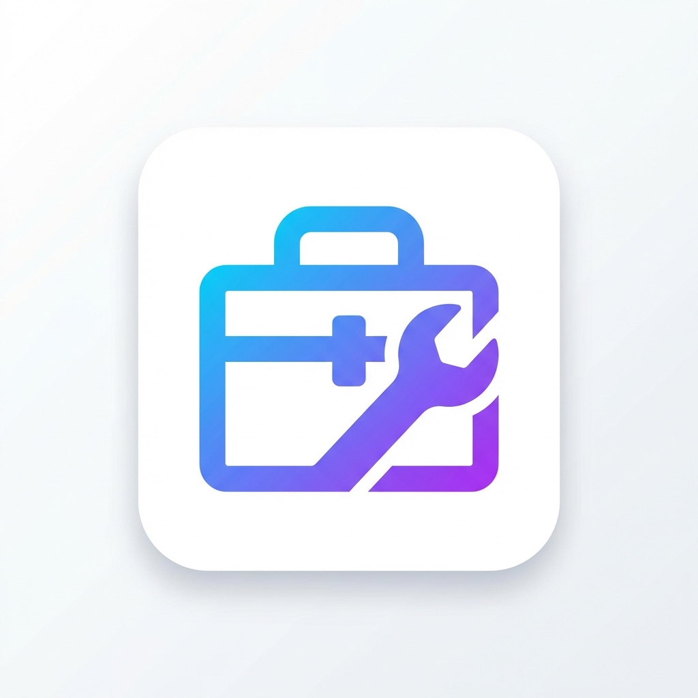

# DevToolbox

Essential utilities for developers to boost productivity in VS Code.



## Features

DevToolbox provides a collection of handy developer utilities accessible from the sidebar:

### 🗑️ Remove Console Logs

Quickly remove all `console.log()` statements from your active file. Perfect for cleaning up debugging code before committing.

### 💬 Remove Comments

Strip all comments from your active file. Useful for creating minified versions or cleaning up heavily commented code.

### 🌿 Prune Merged Branches

Clean up your local Git repository by removing branches that have already been merged. Keeps your branch list tidy.

### 🔄 Auto-Update System

- Automatically checks for updates once per day
- Notifies you when new versions are available
- One-click download and installation
- Manual update check via Command Palette

## Installation

### From GitHub Releases (Recommended)

1. Go to [Releases](https://github.com/andersseen/andersseen-kit/releases)
2. Download the latest `.vsix` file
3. In VS Code, go to Extensions (`Cmd+Shift+X` / `Ctrl+Shift+X`)
4. Click the `...` menu → `Install from VSIX...`
5. Select the downloaded `.vsix` file

### From Source

```bash
git clone https://github.com/andersseen/andersseen-kit.git
cd andersseen-kit
pnpm install
pnpm run package
code --install-extension andersseen-kit-0.0.1.vsix
```

## Usage

### Accessing Tools

1. Click the DevToolbox icon in the Activity Bar (left sidebar)
2. Browse available tools in the sidebar
3. Click any tool to execute it

### Command Palette

All tools are also available via Command Palette (`Cmd+Shift+P` / `Ctrl+Shift+P`):

- `DevToolbox: Remove Console Logs`
- `DevToolbox: Remove Comments`
- `DevToolbox: Prune Merged Branches`
- `DevToolbox: Check for Updates`

## Configuration

Configure update checking in VS Code settings:

```json
{
  "devtoolbox.updateCheck.owner": "andersseen",
  "devtoolbox.updateCheck.repo": "andersseen-kit"
}
```

## Requirements

- VS Code version 1.108.1 or higher
- Git (for branch pruning feature)

## Extension Settings

This extension contributes the following settings:

- `devtoolbox.updateCheck.owner`: GitHub repository owner for update checks (default: "andersseen")
- `devtoolbox.updateCheck.repo`: GitHub repository name for update checks (default: "andersseen-kit")

## Known Issues

- Branch pruning requires Git to be installed and available in PATH
- Update checking requires internet connection

## Release Notes

See [CHANGELOG.md](CHANGELOG.md) for detailed release notes.

### 0.0.1

Initial release with core developer utilities:

- Remove Console Logs
- Remove Comments
- Prune Merged Branches
- Auto-update system

## Contributing

Contributions are welcome! Please feel free to submit a Pull Request.

## Deployment

For deployment instructions, see [DEPLOYMENT.md](DEPLOYMENT.md).

## License

This extension is open source and available under the MIT License.

## Support

- 🐛 [Report a bug](https://github.com/andersseen/andersseen-kit/issues)
- 💡 [Request a feature](https://github.com/andersseen/andersseen-kit/issues)
- 📖 [View documentation](https://github.com/andersseen/andersseen-kit#readme)

---

**Enjoy!** 🚀
